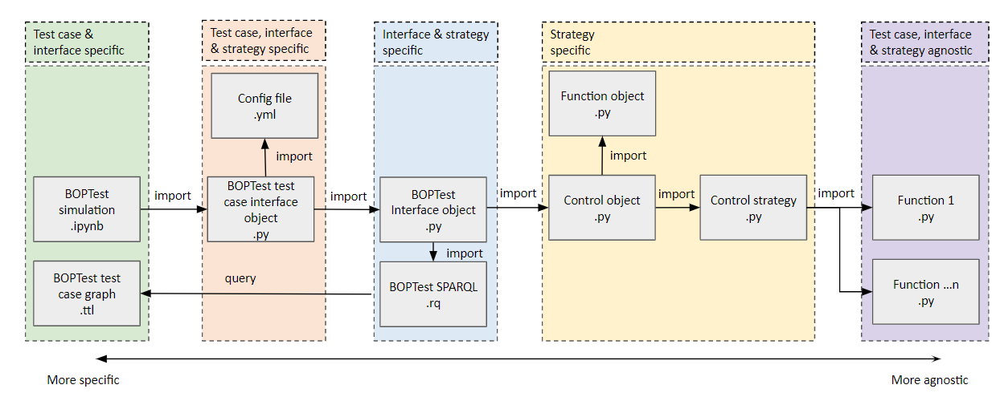
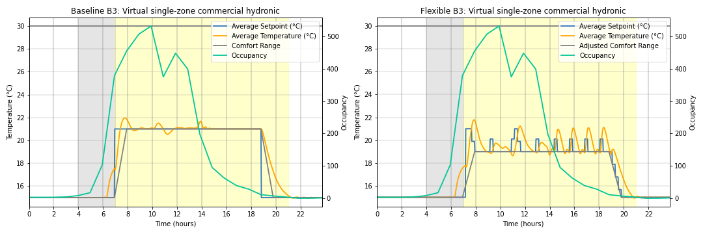
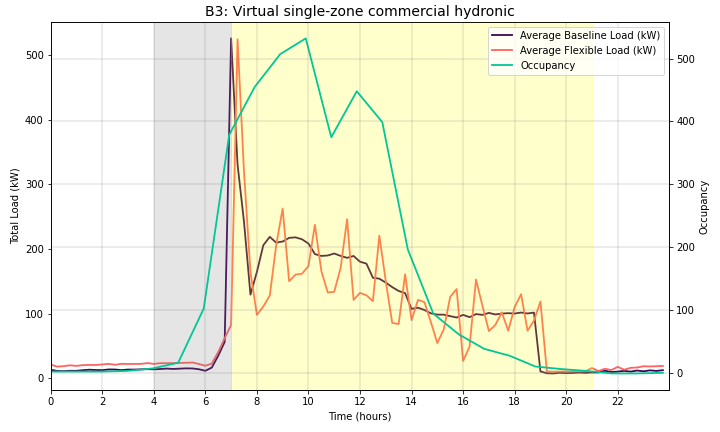
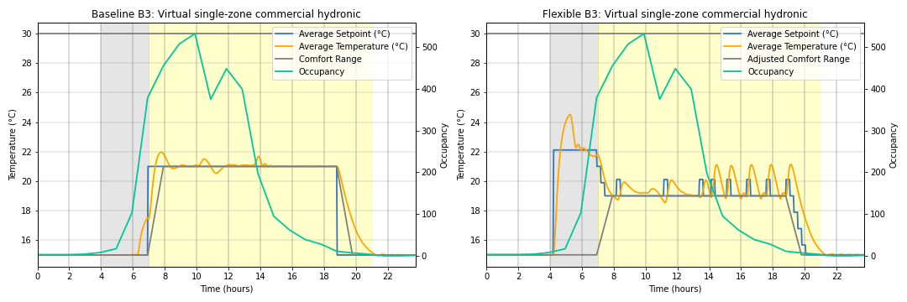
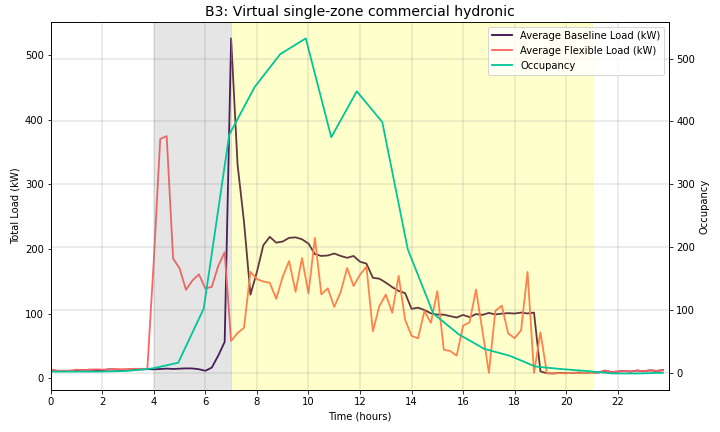

# Demand Flexibility Controls Library using Semantics (DFLEXLIBS)

DFLEXLIBS is a library/repository of HVAC-based demand flexibility control applications developed using Python. The library is based on portable control applications that exclusively contain control logic and are abstract to building details, such as point names and communication protocols. The library leverages semantic models and control platform-oriented interfaces to configure and run the controls in specific buildings. To date, the library contains two applications and two interfaces (for BOPTEST and VOLTTRON) and has been demonstrated in five heterogeneous buildings.

## Getting Started 

To access the library, follow these steps:

1. Clone the repository
   ``` 
   git clone https://github.com/LBNL-ETA/DFLEXLIBS.git 
   ```

2. Install the library and dependencies

   Install the controls library using the development mode. Run the following command:

   ```
   python setup.py develop
   ```

   Install the required dependencies by using the `requirements.txt file`. Run the following command:

   ```
   pip install -r requirements.txt
   ``` 

   Alternatively, create a virtual environment with the controls package and other required dependencies using `pipenv`. Run the following command:

   ``` 
   pipenv install --dev
   ```

## Validating and Running BOPTEST Examples

To run BOPTEST examples, follow these steps:

1. Open the `_examples/boptest` directory.

2. Select the test case

   Navigate to the directory of the test case you want to run.

3. Run the validation

   In the test case directory, run the `validation.ipynb` module for that test case. Select the corresponding manifest file available in the `examples/boptest/validation_buildingMOTIF/` directory.

   As of now, all test cases are able to run the `zone_temp_shed_price` and `zone_temp_shif_shed_price` applications.

4. Run the simulation

   If the selected test case is valid for a given control application, select it in the `simulation.ipynb` module. It will first run the test case baseline control and generate plots. Then it will run the proposed DF control application and generate plots. You can see refined plots of the tested applications in the `results` directories for each test case. 

## Contributing

If you are interested in contributing to the library:

- You are welcome to report any issues in [Issues](https://github.com/LBNL-ETA/DFLEXLIBS/issues).
- You are also welcome to follow the [Contribution Guide](https://github.com/LBNL-ETA/DFLEXLIBS/edit/main/doc) for:
   - Creating new control functions and applications
   - Running the control applications reusing the available interfaces (BOPTEST and VOLTTRON)
   - Creating new interfaces to run the applications in other control platforms/environments

## DFLEXLIBS Workflow

The below image shows the different files required to run a test example for BOPTEST:



## Control Flow Example 

As an example, the zone_temp_shift_shed_price application is shown in the image below. The _DR shift_ strategy identifies if the site should be preheated or precooled based on the season and a load up time parameter that tells the control strategy how far forward to look to find a _DR shed_ opportunity. This application finds opportunities to conduct energy arbitrage using stored thermal energy in the building. 


The strategy works as follows
* Initialization _config.yml_ (case-specific/control-specific routine)
   - **sparql_query**: #path to interface query.
   - **graph_path**: #path to each test case Brick graph.
   - **price_identifier**:  #identifier to get the price signal.
   - **price_threshold_value**: #price threshold to activate the DR strategies.
   - **Tlimit_min**:  #upper bound on the range of permitted values of a temperature setpoint. 
   - **Tlimit_max**:  #lower bound on the range of permitted values of a temperature setpoint.
   - **hvac_mode_identifier**:  #identifier to get control signal (for test cases in which HVAC mode estimation is based on a single control signal). 
   - **heat_signal_identifier**: #identifier to get heating control signal (for test cases which have a heating control signal).
   - **cool_signal_identifier**: #identifier to get cooling control signal (for test cases which have a cooling control signal).
   - **adj_comfort_range_flag**: #boolean flag to define if comfort range adjustment is needed
   - **adj_comfort_range_value**: #temperature value (offset) to define how much the comfort range can be adjusted
   - **shift_horizon_time**: # hours ahead to start shift period (not required for shed)

* Instantiate interface (case-agnostic/control-specific routine)
   - **Interface object** based on the DRInterface protocol
   - **Function object** based on the DRControlFunctions protocol
   - **Control object** based on the DRControlStrategy protocol

* Call SPARQL query to instantiate the test cases’ control points (case-agnostic/control-specific routine)
    - **TZonPoint**: identifier for the temperature measurement point per zone
    - **TSetHeaZonPoint**: identifier for the heating temperature setpoint per zone
    - **TSetCooZonPoint**: identifier for the cooling temperature setpoint per zone
    - **TSetZonPoint**: identifier for the temperature setpoint per zone
    - **TSetMinPoint**: identifier for the minimum temperature setpoint per zone (baseline)
    - **TSetMaxPoint**: identifier for the maximum temperature setpoint per zone (baseline)
    - **occSensorPoint**: identifier for the occupancy sensor per zone (baseline)

The query can capture TSetZon as an alternative when there aren’t Heat and Cool setpoints, and then logic inside controller_agent defines if it corresponds to heating or cooling according to HVAC operation mode.

* Compute the control strategy (case-agnostic/control-specific routine)

## Test Results Example

Example of results obtained by the BOPTEST Singlezone Commercial Hydronic test case ([link](https://ibpsa.github.io/project1-boptest/testcases/ibpsa/testcases_ibpsa_singlezone_commercial_hydronic/)) for shed-only and shift and shed control applications.

  - **DF shed-only control (mix day)**
   
 Adjustment in the zone temperature setpoints and activation of the flexible (shed-only) control in an average day for the singlezone_commercial_hydronic. The gray and yellow shaded areas represent the shift and shed periods, respectively.

 

 
Daily average power loads for the baseline and the flexible (shed-only) control in the singlezone_commercial_hydronic. 




 
  - **DF shit and shed control (mix day)**


Adjustment in the zone temperature setpoints and activation of the flexible (shift and shed) control in an average day for the singlezone_commercial_hydronic. 

 


Daily average power loads for the baseline and the flexible (shift and shed) control in the singlezone_commercial_hydronic. 



## Copyright Notice

Demand Flexibility Controls Library using Semantics (DFLEXLIBS) 
Copyright (c) 2023, The Regents of the University of California,
through Lawrence Berkeley National Laboratory (subject to receipt of
any required approvals from the U.S. Dept. of Energy). All rights reserved.

If you have questions about your rights to use or distribute this software,
please contact Berkeley Lab's Intellectual Property Office at
IPO@lbl.gov.

NOTICE.  This Software was developed under funding from the U.S. Department
of Energy and the U.S. Government consequently retains certain rights.  As
such, the U.S. Government has been granted for itself and others acting on
its behalf a paid-up, nonexclusive, irrevocable, worldwide license in the
Software to reproduce, distribute copies to the public, prepare derivative 
works, and perform publicly and display publicly, and to permit others to do so.

## License

DFLEXLIBS is available under the following open-source [license](https://github.com/LBNL-ETA/DFLEXLIBS/edit/main/License.txt).

## Related Publications

Paul, Lazlo; De Andrade Pereira, Flavia; Ham, Sang woo;Pritoni, Marco; Brown, Rich; Feng, Jingjuan Dove. Open Building Operating System: an Open-Source Grid Responsive Control Platform for Buildings (2023). ASHRAE Annual Conference 2023.

de Andrade Pereira, Flavia; Pritoni, Marco; Martín-Toral, Susana; Finn, Donal; O’Donnell, James. A semantics-driven framework for scalable demand flexibility control applications (2023). Proceedings of the 2023 European Conference on Computing in Construction and the 40th International CIB W78 Conference.
http://www.doi.org/10.35490/EC3.2023.341
